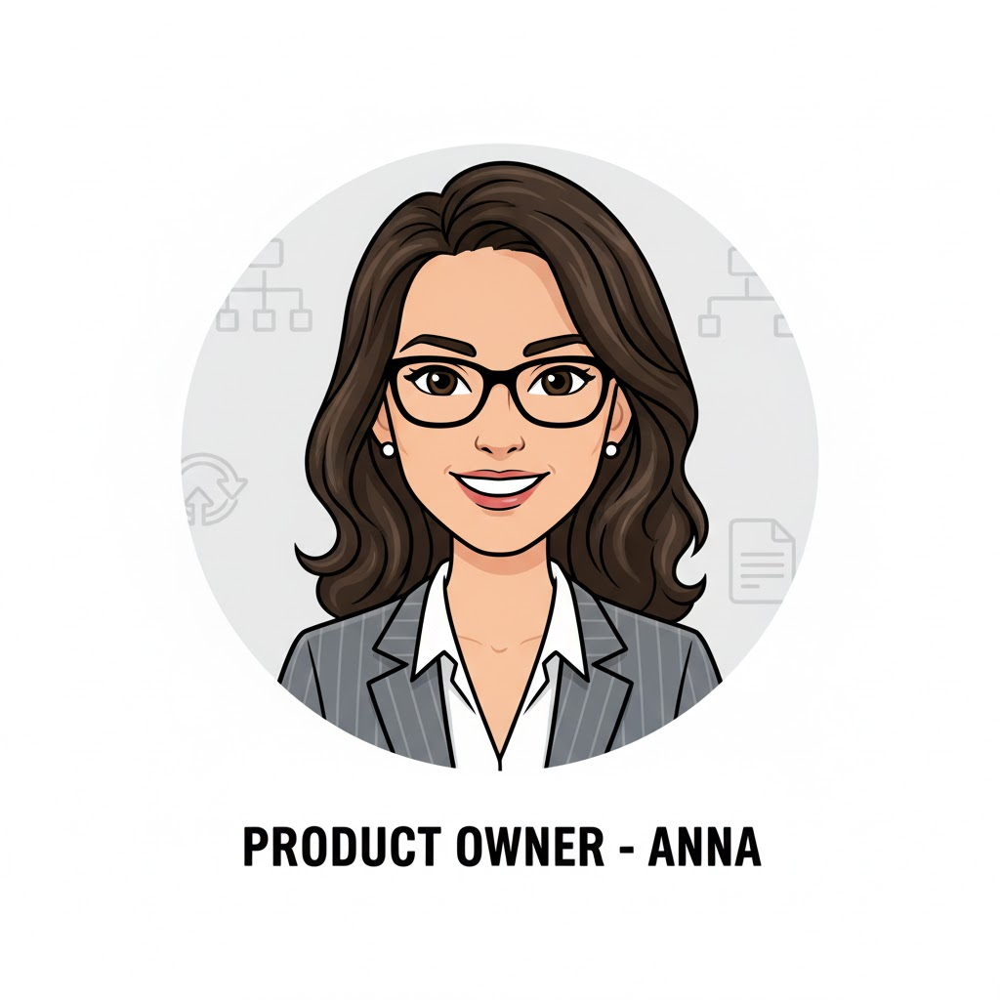

<style>
section {
  font-size: x-large;
}
</style>

# **Application monitoring <br/> for team leads**

How to use logging and metrics to guide a team 
and inform the customer. 

&nbsp;  

[github.com:pdenooijer/incident-metrics-course.git]()

---

# Introductions

- Piet de Nooijer
- Maarten Veldink

---

# Observability
<!-- Check participants knowledge, also introduce the elements of the workshop (logging, metrics, etc).--> 
What is observability?
What elements can we identify?
What do we use it for?

---

# But first... meet the team!
<!-- Setting the stage, creating a team-lead narrative to refer to during the rest of the workshop. -->
<style scoped>
p {
display: flex;
justify-content: space-around;
align-items: center;
height: 80%; /* Adjust height as needed */
}
p img {
flex-grow: 1;
max-width: 18%; 
max-height: 100%;
object-fit: contain;
margin: 0 10px; /* Add some horizontal space between images */
}
</style>




  

---

# Observability from a PO's perspective
<!-- 
Why would you need observability in this role?
Report to stakeholders, verify SLAs, 
make substantiated decisions on technical improvements
--> 
<style scoped>
p {
display: flex;
justify-content: space-around;
align-items: center;
height: 80%; /* Adjust height as needed */
}
p img {
flex-grow: 1;
max-width: 30%; 
max-height: 100%;
object-fit: contain;
margin: 0 10px; /* Add some horizontal space between images */
}
</style>


---

# Observability from a developers perspective
<!-- 
Why would you need observability in this role? 
- Verify solutions
- Identify problems earlier 
- Analyse problems more efficiently 
-->
<style scoped>
p {
display: flex;
justify-content: space-around;
align-items: center;
height: 80%; /* Adjust height as needed */
}
p img {
flex-grow: 1;
max-width: 30%; 
max-height: 100%;
object-fit: contain;
margin: 0 10px; /* Add some horizontal space between images */
}
</style>


---

# Observability from a testers perspective
<!-- Why would you need observability in this role? 
- Identify issues yourself
- Monitor performance
- Automated verification of non-functionals
- Monitoring of pipelines
--> 
<style scoped>
p {
display: flex;
justify-content: space-around;
align-items: center;
height: 80%; /* Adjust height as needed */
}
p img {
flex-grow: 1;
max-width: 30%; 
max-height: 100%;
object-fit: contain;
margin: 0 10px; /* Add some horizontal space between images */
}
</style>


---

# Observability from a team-lead perspective
<!-- Why would you need observability in this role? 
- Monitor team performance
- Identify problems
- Keep an overview of systems
- Verify architectural constraints
--> 
<style scoped>
p {
display: flex;
justify-content: space-around;
align-items: center;
height: 40%; /* Adjust height as needed */
}
p img {
flex-grow: 1;
max-width: 18%; 
max-height: 100%;
object-fit: contain;
margin: 0 10px; /* Add some horizontal space between images */
}
</style>


---

# Aspects of observability

- Logging
  - 09:00 - 11:00 
- Metrics
  - 11:00 - 14:00 
- Tracing & alerting
  - 14:00 - 14:30
- Reporting
  - 14:30 - 15:00
---

# Logging

> If it’s not logged, it didn’t happen.

---

# Logging - why logging matters

- Essential for **monitoring**, **debugging**, and **auditing**
- Helps identify issues before users notice them
- Good logs shorten **MTTR** (Mean Time To Recovery).
- Enables better **incident response** and **root cause analysis**

---

# Logging - what makes good logging
## Logging ≠ Print Statements

> Logging is part of your **observability strategy**, not just debugging.

- Logs should explain **why** something happened — not just *what* happened.
- Think in terms of **diagnostics**, **accountability**, and **operational insight**.

🧠 *Design logs as you design APIs: intentional and structured.*

---

# Logging - what makes good logging
## Structure and Context

> Flat text is dead — context-rich, structured logs rule.

- Prefer **structured (JSON)** logging.
- Include context, etc. in every log.
- Use **MDC (Mapped Diagnostic Context)** to propagate metadata.

```java
MDC.put("requestId", requestId);
log.info("Order processed: {}", orderId);
MDC.clear();
```
---

# Tooling

<style scoped>
p {
display: flex;
justify-content: space-around;
align-items: center;
height: 80%; /* Adjust height as needed */
}
p img {
flex-grow: 1;
max-width: 18%; 
max-height: 100%;
object-fit: contain;
margin: 0 10px; /* Add some horizontal space between images */
}
</style>


---

# Let's dive in!

- Clone repo: github.com:pdenooijer/incident-metrics-course.git
- Follow the instructions in the README
 
---

# Logging 
<!-- 09:30 - 09:40 --> 

**Exercise 1: Review the logging in Elastic Search**

- What do you notice? 
- Can you determine why you get no responses? 

---

# Logging 
<!-- 09:30 - 09:50 --> 

**Exercise 2: Review  the code in the repository**

- What do you notice? 
- Make changes where necessary, 
  - change only the logging, not the 'business logic'
- Can you identify the bug from your logging?   

---

# Logging 
<!-- 09:50 - 10:10 --> 

**Exercise 3: Setup some guidelines for your team**

- Define what makes 'proper' logging 
- Make rules comprehensible for juniors to seniors
- Discuss in pairs 

---
<!-- 10:10 - 10:25 -->

# ☕ Break

---

# Logging 
<!-- 10:25 - 10:45 -->

**Lessons learned**

Plenary discussion of guidelines

---

## 1️⃣ Overly Verbose Logging ("Log Spam")

**Symptom:** Thousands of log lines per minute, even under normal load.  
**Problem:** Important info is buried, logs grow fast, and analysis becomes painful.

```java
log.debug("Loop iteration {}", i); // In a loop of 10,000 iterations
````

---

## 2️⃣ Insufficient Logging

**Symptom:** Errors happen, but no useful log messages.
**Problem:** Debugging becomes guesswork.

```java
catch (Exception e) {
    // Nothing logged
}
```

✅ Always log meaningful context when catching exceptions.

---

## 3️⃣ Wrong Log Levels

**Symptom:** Everything is logged as ERROR, or real errors at INFO.
**Problem:** Misleading alerts or missed issues.

```java
log.error("Cache miss for key {}", key); // Should be WARN or INFO
```

✅ Use `ERROR` only for failures that affect functionality.

---

## 4️⃣ Logging Sensitive Data

**Symptom:** Passwords, tokens, or PII in logs.
**Problem:** Security and GDPR violations.

```java
log.info("User login with password={}", password);
```

🚫 Never log secrets, credentials, or personal data.

---

## 5️⃣ Vague or Meaningless Messages

**Symptom:** Logs without context.
**Problem:** Impossible to diagnose what actually failed.

```java
log.error("Something went wrong");
```

✅ Include component and context:
`[OrderService] Failed to process order 1234`

---

## 6️⃣ Missing Stacktrace or Exception Details

**Symptom:** Error is logged, but no stacktrace.
**Problem:** Root cause is hidden.

```java
catch (Exception e) {
    log.error("Error processing request: " + e.getMessage());
}
```

✅ Always pass the exception object:
`log.error("Failed to process request", e);`

---

## 7️⃣ Duplicate Logging of the Same Error

**Symptom:** Same exception logged multiple times.
**Problem:** Noise and confusion in logs.

```java
try {
    service.doSomething();
} catch (Exception e) {
    log.error("Error in service", e);
    throw e; // Logged again higher up
}
```

✅ Log once, at the level where it’s actually handled.

---

## 8️⃣ String Concatenation in Log Messages

**Symptom:** Using `+` instead of placeholders.
**Problem:** Strings built even when logging is disabled.

```java
log.debug("Result: " + expensiveComputation());
```

✅ Use placeholders:
`log.debug("Result: {}", result);`

---

## 9️⃣ Inconsistent or Unstructured Logs

**Symptom:** Different formats and missing context.
**Problem:** Hard to parse or search in ELK / Loki.

```java
log.info("Order complete: {}", 12345);
log.info("Processed order id={}", orderId);
```

✅ Define a consistent logging format across the team.

---

## 🔟 No Correlation or Traceability

**Symptom:** Impossible to link logs across services.
**Problem:** Distributed debugging nightmare.

```java
log.info("[traceId={}] Request completed", traceId);
```

✅ Always include a trace or request ID

---

## 🎛️ Log Levels
<style scoped>
table {
   font-size: x-large;
}
</style>

| Level   | Purpose                       | Example                                    |
|---------|-------------------------------|--------------------------------------------|
| `TRACE` | Very detailed, internal state | Method-level entry/exit                    |
| `DEBUG` | Developer-focused info        | Query parameters, object states            |
| `INFO`  | Application events            | Startup, shutdown, key transactions/events |
| `WARN`  | Potential issues              | Fallbacks, retries                         |
| `ERROR` | Failures                      | Exceptions, failed transactions            |
| `FATAL` | Failures                      | Non-recoverable error that cause downtime  |

Experienced developers know: log level inflation kills signal-to-noise ratio.
Keep verbosity low in production — more logs ≠ more visibility.

--- 

# ✅ Summary

**Good logging is about:**

* Context, not volume
* Correct severity levels
* No sensitive data, use (generated) identifier instead
* Consistent structure
* Traceability across systems

--- 

# Metrics TODO
<!-- 10:45 - 12:00 -->
- Tools en frameworks
  - OpenTelemetry
  - 

- Wat meten we?
  - Platform monitoring vs application monitoring
  - RED / USE / 4 golden signals
   
- Welke tools zijn er? 
  - Grafana/Prometheus
  - Elastic APM
  - Azure Application Insights 
  - AWS X-Ray

---
# Metrics - storage
<style scoped>
p {
display: flex;
justify-content: space-around;
align-items: center;
height: 80%; /* Adjust height as needed */
}
p img {
flex-grow: 1;
max-width: 18%; 
max-height: 100%;
object-fit: contain;
margin: 0 10px; /* Add some horizontal space between images */
}
</style>


---

# Metrics - visualisation
<style scoped>
p {
display: flex;
justify-content: space-around;
align-items: center;
height: 80%; /* Adjust height as needed */
}
p img {
flex-grow: 1;
max-width: 18%; 
max-height: 100%;
object-fit: contain;
margin: 0 10px; /* Add some horizontal space between images */
}
</style>


---

# Metrics - frameworks

Understand the key frameworks for measuring service health and performance.

- RED
- USE
- 4 Golden Signals

---

## 🟥 RED Method

**R**ate – how many requests per second your service handles
**E**rrors – how many requests fail
**D**uration – how long each request takes

### 💡 Example
- **Rate:** 500 checkouts per minute
- **Errors:** 10 payment failures
- **Duration:** 2 seconds per checkout

If duration spikes or errors rise → performance problem.

➡️ Best for **APIs** and **web services**.

---

## 🧮 USE Method

**U**tilization – how busy a resource is (CPU, memory)
**S**aturation – how full or overloaded it is
**E**rrors – hardware or system-level issues

### 💡 Example
- **Utilization:** CPU at 85%
- **Saturation:** Disk write queue growing
- **Errors:** Disk read/write failures

➡️ Best for **infrastructure monitoring** (servers, containers, networks).

---

## 🟢 Four Golden Signals

1. **Latency** – time to handle a request
2. **Traffic** – total demand on the system
3. **Errors** – rate of failed requests
4. **Saturation** – how close the system is to limits

### 💡 Example
Video streaming service:
- **Latency:** Video start time
- **Traffic:** Concurrent viewers
- **Errors:** Failed video loads
- **Saturation:** Bandwidth usage

➡️ Works well for **user-facing systems**.

---

## 🧭 Summary

| Framework            | Focus                                                  | Best For                     |
|----------------------|--------------------------------------------------------|------------------------------|
| **RED**              | Requests (Rate, Errors, Duration)                      | Application-level monitoring |
| **USE**              | Resources (Utilization, Saturation, Errors)            | Infrastructure monitoring    |
| **4 Golden Signals** | User experience (Latency, Traffic, Errors, Saturation) | End-to-end service health    |

---

## 📊 Combined View

A **Grafana dashboard** could combine all three:
- RED for app requests
- USE for server metrics
- Golden Signals for user experience

👉 Together they give a complete picture of system health.

--- 

## 🧩 Exercise: Monitor the RabbitMQ Application

### 🎯 Goal
Implement the RED, USE, and 4 Golden Signals metrics in the RabbitMQ setup.

### 🪶 Steps
1. **Design a metrics solution**
2. **Implement given solution**
3. **Visualize:**
   - Export metrics with **Prometheus**
   - Create a **Grafana dashboard** showing all three frameworks

💡 *Tip: Use RabbitMQ’s built-in Prometheus exporter for queue metrics!*

---

# Lunch
<!-- 12:00 - 13:00 -->


--- 

# Tracing

<!-- 14:30 - 15:00 -->
<style scoped>
p {
display: flex;
justify-content: space-around;
align-items: center;
height: 80%; /* Adjust height as needed */
}
p img {
flex-grow: 1;
max-width: 12%; 
max-height: 100%;
object-fit: contain;
margin: 0 10px; /* Add some horizontal space between images */
}
</style>


--- 

# Alerting
<!-- 13:00 - 14:30 -->

---
