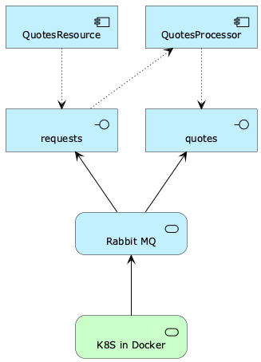

## SRE Workshop - Simple Service Simulator
The Simple Service Simulator (SSS) is a Java application that is capable of emulating a service handler with different quality
attributes and performance characteristics. It can be used to set up a set of collaborating components in order to experiment with
different ways to monitor the behavior of the entire system.

Services communicate in an asynchronous manner, via a RabbitMQ message bus (pub/sub), to allow easy scaling of individual service components
without the need of additional components like load balancers.

